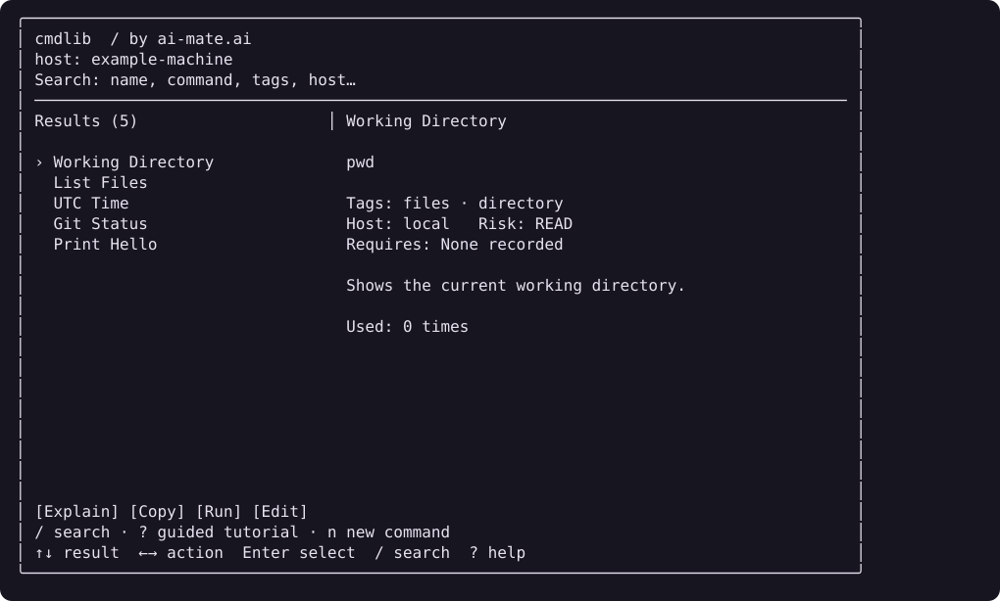

# cmdlib — by ai-mate.ai

A small, offline terminal command library for commands you use too rarely to remember.
Find a command, read its explanation, copy its exact text, or deliberately run it.
Built with Go, Bubble Tea, Bubbles, and Lip Gloss. [ai-mate.ai](https://ai-mate.ai) is the project attribution.



The preview is captured from the actual TUI view using generic examples and a synthetic host.

## Install

Download the matching archive and `checksums.txt` from [Releases](https://github.com/dompy/cmdlib/releases).
Archives cover macOS Intel / Apple Silicon and Linux amd64 / arm64.
Verify with `shasum -a 256` on macOS or `sha256sum` on Linux, extract, and put `cmdlib` on your PATH.

For a backed-up, user-local installation, download and inspect the versioned installer:

```sh
curl -fsSL https://raw.githubusercontent.com/dompy/cmdlib/v0.1.0/scripts/install.sh -o /tmp/install-cmdlib.sh
sh /tmp/install-cmdlib.sh v0.1.0
cmdlib --version
cmdlib
```

The installer verifies the archive against the release checksums and installs to `$HOME/.local/bin/cmdlib`.
Add that directory to PATH if needed. Existing executables or wrappers at that path and an existing
command library are backed up privately; the library is never changed by installation.
See [installation and rollback](docs/install.md).

To build from source with the Go version in `go.mod` or later:

```sh
git clone https://github.com/dompy/cmdlib.git
cd cmdlib
go build -trimpath -o cmdlib .
./cmdlib
```

## Use

Search matches names, command text, descriptions, tags, host labels, and risk labels.
Multiple words must all match; fuzzy abbreviations are supported.
The selected command and details stay visible in the wide terminal layout.

| Key | Action |
| --- | --- |
| `/` | Focus search; normal typing and pasted text work |
| `↑` / `↓` | Select a result |
| `←` / `→` | Select Copy / Run / Edit |
| `Enter` | Activate the selected action |
| `?` | Toggle the selected command's contextual explanation |
| `PgUp` / `PgDown` | Scroll details |
| `n` | Add a command |
| `h` | Guided tutorial, one visible command per step |
| `Esc` | Leave search, clear search, or cancel the active view |
| `q` / `Ctrl+C` | Quit (`q` is normal text while searching) |

In the editor, use Tab / Shift+Tab to select a field, Ctrl+S to save, and Esc to cancel.
Changing command text clears an unchanged explanation so stale documentation does not silently remain.
Tutorial controls are ←/→ for steps, `?` for contextual explanation, `c` Copy, and `r` Run.

Selection and copying never execute a command. Run shows the actual local execution machine and
exact command before confirmation. Type `yes` for READ / CONNECT, `WRITE` for WRITE,
or `RUN <id>` for DANGER. Esc cancels. Commands run locally through `/bin/sh` with your permissions
and current working directory. The explicit command may itself open a remote connection;
a Host label does not route execution. READ and other labels are authored metadata, not safety checks.
Confirmed run attempts are recorded before execution; the count includes failed attempts.

Copy uses `pbcopy` on macOS, `wl-copy` on Wayland, or `xclip` on X11.
Without a working clipboard, the exact command is shown for manual copying.
`?` opens a compact local explanation beside the selected command. Known command tokens get concise built-in hints; stored explanation text remains the fallback. No AI service or network connection is involved.

## Data and privacy

Your library is a local JSON array. Default locations:

- macOS: `~/Library/Application Support/cmdlib/commands.json`
- Linux: `$XDG_CONFIG_HOME/cmdlib/commands.json`, or `~/.config/cmdlib/commands.json`
- Override: `CMDLIB_FILE=/path/to/commands.json cmdlib`

Five harmless examples are created only when the file is absent. Existing libraries, including empty
ones, are preserved. Writes use a private temporary file and atomic replacement. There is no account,
telemetry, server synchronization, credential storage, or LLM API requirement. Remote sync and AI
explanations are possible future work, not implemented features.

Back up the JSON file before editing or upgrading. For example on macOS:

```sh
cp "$HOME/Library/Application Support/cmdlib/commands.json" "$HOME/Library/Application Support/cmdlib/commands.json.bak"
chmod 600 "$HOME/Library/Application Support/cmdlib/commands.json.bak"
```

Treat your library and exports as private: shell commands can contain secrets. Do not commit them,
upload them with bug reports, or include them in screenshots. cmdlib does not encrypt the file.

## Navi export

```sh
cmdlib export navi > commands.cheat
```

Export writes to stdout and never executes commands. Commands containing newlines, carriage returns,
`<` or `>`, or beginning (after whitespace) with `#`, `%`, or `$` are skipped because Navi may interpret
those as syntax. The skipped count is reported on stderr. Explanations, prerequisites, and usage
history are not exported. Import is not implemented. Navi has its own execution behavior; cmdlib's
confirmation does not apply once commands are exported.

## Tea

```sh
cmdlib --tea
```

```text
╭───────────────────────────────────╮
│                                   │
│   Go dress cmdlib in Lip Gloss.    │
│   Serve Bubble Tea with Bubbles.   │
│                                   │
│              ready.               │
│                                   │
╰───────────────────────────────────╯
```

The program renders a rounded purple frame in a color terminal. `NO_COLOR` and redirected output
remain readable without ANSI color codes. `--help`, `--version`, and `--tea` do not load or create a library.

## Development

```sh
gofmt -w main.go main_test.go internal
go test ./...
go vet ./...
go build -trimpath -o cmdlib .
python3 scripts/smoke.py ./cmdlib
```

CI uses hosted runners for native tests on all four release targets and checks formatting, race tests,
vet, dependency vulnerabilities, and secrets in Git history. See [release instructions](docs/releases.md),
[contributing](CONTRIBUTING.md), and [security](SECURITY.md). Original code is MIT licensed;
[third-party notices](THIRD_PARTY_NOTICES.md) retain dependency license terms.
